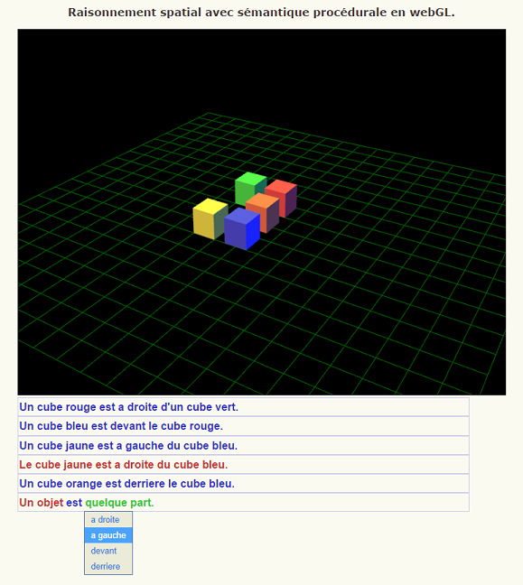
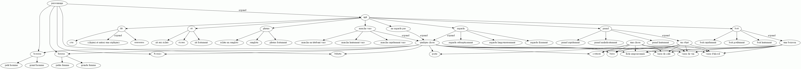

clickWrite
==========

Experiment with Johnson-Laird's Procedural Semantics on spatial reasonning, webGL and text generation based menu interface.

### Description

### Example of game

### References
- Johnson-Laird, Philip N (1983). Mental Models: Toward a Cognitive Science of Language, Inference and Consciousness. Harvard University Press.
- Roger Evans and Richard Power (2003) WYSIWYM: building user interfaces with natural language feedback. Research notes and demonstration papers at EACL-03, pp. 203-206, Budapest, Hungary.
